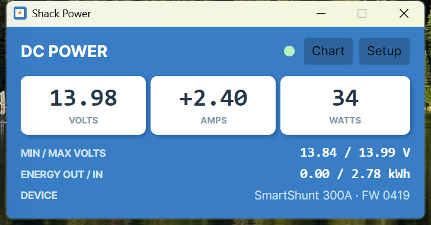
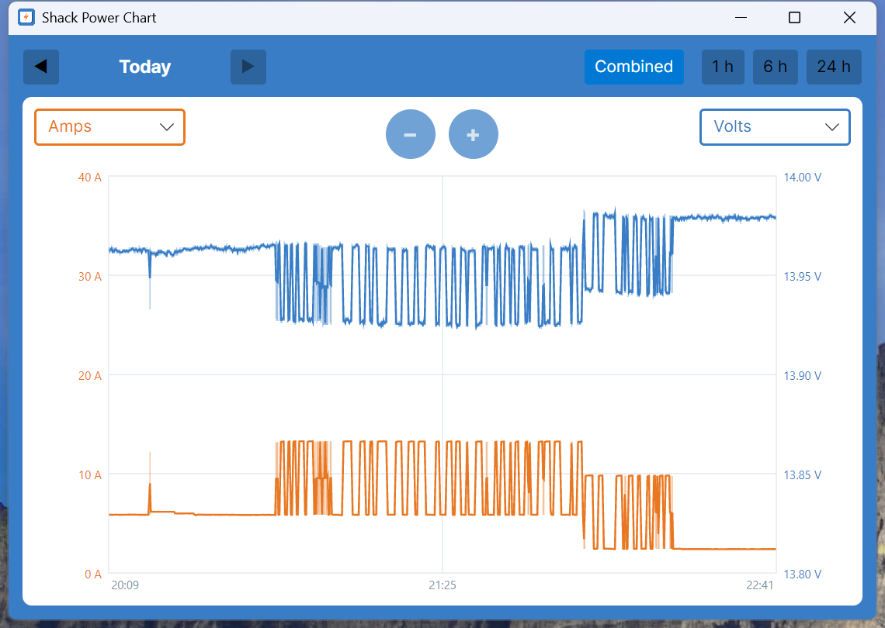
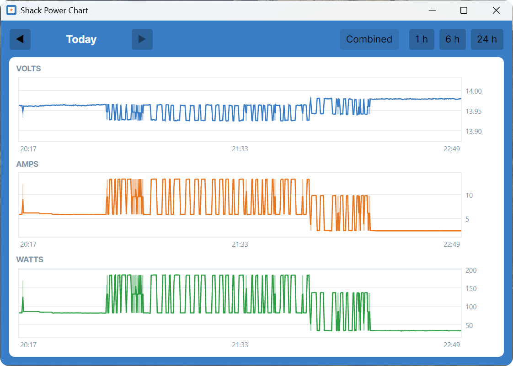

# Shack Power

Desktop monitor for a Victron SmartShunt over VE.Direct serial — live volts / amps / watts,
daily CSV power logging, and history charts. Windows, Linux, and Raspberry Pi (arm64).

Built because VictronConnect is a configuration tool, not a monitor: it grabs every free COM
port while open and offers no logging. Shack Power opens exactly one port (pinned to the
VE.Direct cable's chip serial, so COM renumbering doesn't matter), parses the SmartShunt's
1 Hz broadcast with checksum validation, and reconnects by itself across unplugs and sleep/resume.

**Scope:** Shack Power monitors; VictronConnect (on your phone, over Bluetooth — they coexist)
configures. Two ways to read the system:

- **A VE.Direct USB cable on the PC** — one SmartShunt, the original design.
- **A Cerbo GX over the network (Modbus TCP)** — the hub owns the SmartShunt, a MultiPlus
  inverter/charger and, later, an MPPT; Shack Power adds CHARGER and SOLAR rows (state, mains
  presence, charge current), battery SOC and time-to-go, and finds the hub's Modbus unit IDs for
  you. Charger quiet-mode control (DVCC charge-current limit) is built and tested but not yet
  exposed — it waits on a GX-side watchdog; see [docs/cerbo-modbus.md](docs/cerbo-modbus.md).

The shack power system this serves (MultiPlus + Epoch 105 Ah LiFePO4 + Cerbo GX, charger
inhibited while operating for RF quiet) is written up in
[docs/power-system.md](docs/power-system.md).

Part of the AB0R station-tools family alongside
[W2 Monitor](https://github.com/gsa700/w2-monitor-x) and
[LP-100A Monitor](https://github.com/gsa700/lp100a-monitor), and shares their architecture:
.NET 10 + Avalonia, self-contained single-file releases, self-install (`--install` /
`--uninstall`), and an in-app updater.

## Screenshots

The main readout, live on the station's SmartShunt:



The Chart window's combined view — two channels on color-matched axes, VictronConnect
Trends-style, here catching an evening QSO with OM Mike on 147.555 @ 50 watts output, power cycling on the over:



The same evening in the split view, one strip per channel:



## Features

- Live V / A / W cards in a VictronConnect-inspired look, with min/max voltage, cumulative kWh,
  and alarm decode; voltage colors warn at configurable thresholds
- Daily CSV logs (`power-YYYYMMDD.csv`) — archived, never deleted, and readable by anything
- History charts: live tail plus browsing past days
- Tabbed Setup: connection, logging, display, updates
- Optional minimize-to-tray
- `--sim` mode: the full app on a synthetic SmartShunt — no hardware, no serial port, and its
  logs go to a separate `logs-sim` folder so demo data can never mix into real history

## Building

Needs the .NET 10 SDK (`global.json` pins it).

```sh
dotnet build
dotnet run --project src/ShackPower.App -- --sim
dotnet test
```

GPLv3 — see [LICENSE](LICENSE). By David Erickson (AB0R).
